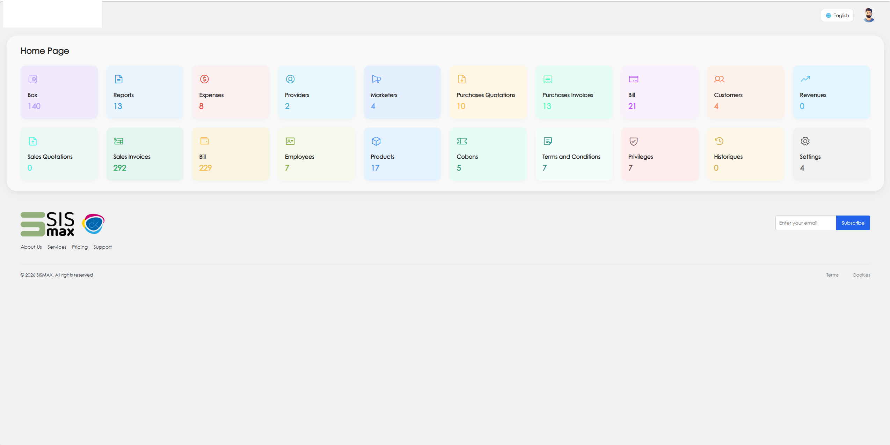

# Accounting & Administrative System Case Study

## Overview
This project is a case study for a full accounting and administrative management system designed to support business operations through a structured and user-friendly interface.

## Project Type
Accounting and administrative business system

## My Role
- Frontend interface structuring
- Business module organization
- Dashboard and navigation layout design
- Screen flow planning for administrative and accounting operations

## Scope
This was not just a dashboard.
The project was built as a complete accounting and administrative system that included multiple operational sections and management modules.

## Business Modules
- Sales
- Purchases
- Customers
- Suppliers
- Cash / Treasury
- Reports
- Products
- Users / Permissions
- Settings

## Tools & Technologies
- HTML
- SCSS
- JavaScript
- Admin UI design principles
- Business workflow structuring

## Key Features
- Multi-module accounting system interface
- Arabic-first business-oriented layout
- Clear navigation between accounting and admin sections
- Card-based overview for fast operational access
- Structured module presentation for daily business use

## Screenshot

## Privacy Note
The source code is intentionally not included in this repository.
This case study is shared to present the system structure, interface design approach, and business workflow organization without exposing private code or client-sensitive implementation details.
